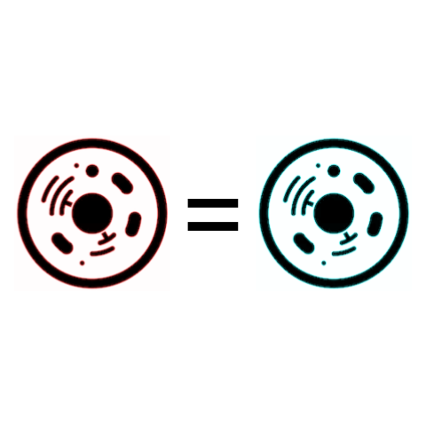

<p align="center">
  
</p>

<h1 align="center">
  Biomappings
</h1>

<p align="center">
    <a href="https://github.com/biomappings/biomappings/actions?query=workflow%3A%22Check+mappings%22">
        
    </a>
    <a href="https://pypi.org/project/biomappings">
        
    </a>
    <a href="https://pypi.org/project/biomappings">
        
    </a>
    <a href="https://github.com/biomappings/biomappings/blob/main/LICENSE">
        
    </a>
    <a href="https://zenodo.org/badge/latestdoi/285352907">
        
    </a>
</p>

Community curated and predicted equivalences and related mappings between named biological entities that are not
available from primary sources.

## 💾 Data

The data are available through the following three files on
the [biomappings/biomappings](https://github.com/biomappings/biomappings) GitHub repository.

| Curated | Description                      | Link |
| ------- | -------------------------------- | ----------- |
|  Yes    | Human-curated true mappings      | [`src/biomappings/resources/mappings.tsv`](https://github.com/biomappings/biomappings/raw/master/src/biomappings/resources/mappings.tsv) |
|  Yes    | Human-curated *non-trivial* false (i.e., incorrect) mappings | [`src/biomappings/resources/incorrect.tsv`](https://github.com/biomappings/biomappings/raw/master/src/biomappings/resources/incorrect.tsv) |
|  No     | Automatically predicted mappings | [`src/biomappings/resources/predictions.tsv`](https://github.com/biomappings/biomappings/raw/master/src/biomappings/resources/predictions.tsv) |

These data are available under
the [CC0 1.0 Universal License](https://github.com/biomappings/biomappings/blob/master/LICENSE).

Equivalences and related mappings that are available from the OBO Foundry and other primary sources can be accessed
through [Inspector Javert's Xref Database](https://zenodo.org/record/3757266)
on Zenodo which was described in [this blog post](https://cthoyt.com/2020/04/19/inspector-javerts-xref-database.html).

## 📊 Summary

A summary is automatically generated nightly with GitHub Actions and deployed to
https://biomappings.github.io/biomappings/.

The equivalences are also available as a network through
[NDEx](https://www.ndexbio.org/viewer/networks/402d1fd6-49d6-11eb-9e72-0ac135e8bacf).

## 🙏 Contributing

### GitHub Web Interface

GitHub has an interface for editing files directly in the browser. It will take care of creating a branch for you and
creating a pull request. After logging into GitHub, click one of the following links to be brought to the editing
interface:

- [True Mappings](https://github.com/biomappings/biomappings/edit/master/src/biomappings/resources/mappings.tsv)
- [False Mappings](https://github.com/biomappings/biomappings/edit/master/src/biomappings/resources/mappings.tsv)
- [Predictions](https://github.com/biomappings/biomappings/edit/master/src/biomappings/resources/mappings.tsv)

This has the caveat that you can only edit one file at a time. It's possible to navigate to your own forked version of
the repository after, to the correct branch (will not be the default one), then edit other files in the web interface as
well. However, if you would like to do this, then it's probably better to see the following instructions on contributing
locally.

### Locally

1. Fork the repository at https://github.com/biomappings/biomappings, clone locally, and make a new branch (see below)
2. Edit one or more of the resource files (`mappings.tsv`, `incorrect.tsv`, `predictions.tsv`)
3. Commit to your branch, push, and create a pull request back to the upstream repository.

### 🌐 Web Curation Interface

Rather than editing files locally, this repository also comes with a web-based curation interface. Install the code in
development mode with the `web` option (which installs `flask` and `flask-bootstrap`) using:

```bash
$ git clone git+https://github.com/biomappings/biomappings.git
$ cd biomappings
$ pip install -e .[web]
```

The web application can be run with:

```bash
$ biomappings web
```

It has a button for creating commits, but you'll also have to make pushes from the repository yourself after reviewing
the changes.

**Note** if you've installed `biomappings` via PyPI, then running the web curation interface doesn't make much sense,
since it's non-trivial for most users to find the location of the resources within your Python installation's
`site-packages` folder, and you won't be able to contribute them back.


## ⬇️ Installation

The most recent release can be installed from
[PyPI](https://pypi.org/project/biomappings/) with:

```bash
$ pip install biomappings
```

The most recent code and data can be installed directly from GitHub with:

```bash
$ pip install git+https://github.com/biomappings/biomappings.git
```

To install in development mode, use the following:

```bash
$ git clone git+https://github.com/biomappings/biomappings.git
$ cd biomappings
$ pip install -e .
```

## 💪 Usage

There are three main functions exposed from `biomappings`. Each loads a list of dictionaries with the mappings in each.

```python
import biomappings

true_mappings = biomappings.load_mappings()

false_mappings = biomappings.load_false_mappings()

predictions = biomappings.load_predictions()
```

Alternatively, you can use the above links to the TSVs on GitHub in with the library or programming language of your
choice.

The data can also be loaded as [networkx](https://networkx.org/) graphs with the following functions:

```python
import biomappings

true_graph = biomappings.get_true_graph()

false_graph = biomappings.get_false_graph()

predictions_graph = biomappings.get_predictions_graph()
```

## ⚖️ License

Code is licensed under the MIT License.
