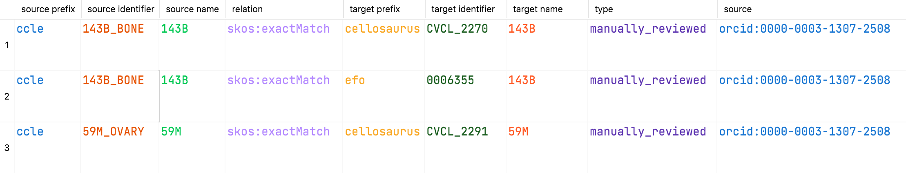

<p align="center">
  
</p>

<h1 align="center">
  Biomappings
</h1>

<p align="center">
    <a href="https://github.com/biopragmatics/biomappings/actions/workflows/tests.yml">
        </a>
    <a href="https://pypi.org/project/biomappings">
        </a>
    <a href="https://pypi.org/project/biomappings">
        </a>
    <a href="https://github.com/biopragmatics/biomappings/blob/main/LICENSE">
        </a>
    <a href='https://biomappings.readthedocs.io/en/latest/?badge=latest'>
        </a>
    <a href="https://codecov.io/gh/biopragmatics/biomappings/branch/main">
        </a>  
    <a href="https://github.com/cthoyt/cookiecutter-python-package">
        </a>
    <a href="https://github.com/astral-sh/ruff">
        </a>
    <a href="https://github.com/biopragmatics/bioregistry">
        </a>
    <a href="https://github.com/biopragmatics/biomappings/blob/main/.github/CODE_OF_CONDUCT.md">
        </a>
    <a href="https://zenodo.org/badge/latestdoi/285352907">
        </a>
</p>

Biomappings is a repository of community curated and predicted equivalences and
related mappings between named biological entities that are not available from
primary sources. It's also a place where anyone can contribute curations
of predicted mappings or their own novel mappings. Ultimately, we hope that
primary resources will integrate these mappings and distribute them themselves.

Mappings are stored in a simple TSV file that looks like this:



## 💾 Data

The data are available through the following four files on
the [biopragmatics/biomappings](https://github.com/biopragmatics/biomappings) GitHub repository.

| Curated | Description                                                  | Link                                                                                                                                             |
| ------- |--------------------------------------------------------------|--------------------------------------------------------------------------------------------------------------------------------------------------|
|  Yes    | Human-curated true mappings                                  | [`src/biomappings/resources/mappings.tsv`](https://github.com/biopragmatics/biomappings/raw/master/src/biomappings/resources/mappings.tsv)       |
|  Yes    | Human-curated *non-trivial* false (i.e., incorrect) mappings | [`src/biomappings/resources/incorrect.tsv`](https://github.com/biopragmatics/biomappings/raw/master/src/biomappings/resources/incorrect.tsv)     |
|  Yes    | Mappings that have been checked but not yet decided          | [`src/biomappings/resources/unsure.tsv`](https://github.com/biopragmatics/biomappings/raw/master/src/biomappings/resources/unsure.tsv)           |
|  No     | Automatically predicted mappings                             | [`src/biomappings/resources/predictions.tsv`](https://github.com/biopragmatics/biomappings/raw/master/src/biomappings/resources/predictions.tsv) |

The primary and derived data in this repository are both available under
the [CC0 1.0 Universal License](https://github.com/biopragmatics/biomappings/blob/master/LICENSE).

Predictions are generated by scripts in the [`scripts/`](scripts) folder. Each
uses the utilities from the `biomappings.resources` module to programmatically
interact with the mappings files, e.g., to add predictions.

### 🥒 Derived

The mappings are distributed in the [Simple Standard for Sharing Ontology Mappings
(SSSOM)](https://github.com/mapping-commons/sssom) format
([here](https://github.com/biopragmatics/biomappings/blob/master/docs/_data/sssom))
and can be referenced by PURL such as https://w3id.org/biopragmatics/biomappings/sssom/biomappings.sssom.tsv.
The positive mappings are also available as a network through
[NDEx](https://www.ndexbio.org/#/network/402d1fd6-49d6-11eb-9e72-0ac135e8bacf).

Equivalences and related mappings that are available from the OBO Foundry and other primary sources can be accessed
through [Inspector Javert's Xref Database](https://zenodo.org/record/3757266)
on Zenodo which was described in [this blog post](https://cthoyt.com/2020/04/19/inspector-javerts-xref-database.html).

### 📊 Summary

Summary statistics of the manually curated mappings and predicted mappings
are automatically generated nightly and deployed as a website with GitHub
Actions to https://biopragmatics.github.io/biomappings.

[](https://biopragmatics.github.io/biomappings)

## 🙏 Contributing

We welcome contributions in the form of curations to any of the four primary TSV
files in this repository via a pull request to the main Biomappings repository
at https://github.com/biopragmatics/biomappings.

Predicted mappings can be curated by moving a row in the `predictions.tsv` file
into either the positive mappings file (`mappings.tsv`), negative mappings file
(`incorrect.tsv`), or the unsure mappings file (`unsure.tsv`). Additionally,
the `confidence` column should be removed, a `type` column should be added with
the value `manually_reviewed`, and the `source` column should be changed from
the prediction script's URI to your ORCiD identifier written as a CURIE
(e.g., `orcid:0000-0003-1307-2508`).

Novel mappings can be curated by adding a full row to the positive mappings
file (`mappings.tsv`) following the format of the previous lines.

While Biomappings is generally able to use any predicate written as a [compact URI (CURIE)](http://www.w3.org/TR/curie),
it's preferred to use predicates from the [Simple Knowledge Organization System (SKOS)](https://www.w3.org/2004/02/skos/)
to denote hierarchical relationships. The three most common predicates that are
useful for curating mappings are:

| Predicate                                                                             | Description                                     |
|---------------------------------------------------------------------------------------|-------------------------------------------------|
| [`skos:exactMatch`](https://www.w3.org/2009/08/skos-reference/skos.html#exactMatch)   | The two terms can be used interchangeably       |
| [`skos:broadMatch`](https://www.w3.org/2009/08/skos-reference/skos.html#broadMatch)   | The object term is a super-class of the subject |
| [`skos:narrowMatch`](https://www.w3.org/2009/08/skos-reference/skos.html#narrowMatch) | The object term is a sub-class of the subject   |

### Online via GitHub Web Interface

GitHub has an interface for editing files directly in the browser. It will take care of creating a branch for you and
creating a pull request. After logging into GitHub, click one of the following links to be brought to the editing
interface:

- [True Mappings](https://github.com/biopragmatics/biomappings/edit/master/src/biomappings/resources/mappings.tsv)
- [False Mappings](https://github.com/biopragmatics/biomappings/edit/master/src/biomappings/resources/incorrect.tsv)
- [Unsure Mappings](https://github.com/biopragmatics/biomappings/edit/master/src/biomappings/resources/unsure.tsv)
- [Predictions](https://github.com/biopragmatics/biomappings/edit/master/src/biomappings/resources/predictions.tsv)

This has the caveat that you can only edit one file at a time. It's possible to navigate to your own forked version of
the repository after, to the correct branch (will not be the default one), then edit other files in the web interface as
well. However, if you would like to do this, then it's probably better to see the following instructions on contributing
locally.

### ✍️ Local via a Text Editor

1. Fork the repository at https://github.com/biopragmatics/biomappings, clone locally, and make a new branch (see below)
2. Edit one or more of the resource files (`mappings.tsv`, `incorrect.tsv`, `unsure.tsv`, `predictions.tsv`)
3. Commit to your branch, push, and create a pull request back to the upstream repository.

### 🌐 Local via the Web Curation Interface

Rather than editing files locally, this repository also comes with a web-based curation interface. Install the code in
development mode with the `web` option (which installs `flask` and `flask-bootstrap`) using:

```console
$ git clone https://github.com/biopragmatics/biomappings.git
$ cd biomappings
$ git checkout -b your-branch-name
$ UV_PREVIEW=1 python3 -m pip install -e .[web]
```

The web application can be run with:

```console
$ biomappings web
```

It can be accessed by navigating to http://localhost:5000/ in your browser.
After you do some curations, the web application takes care of interacting with
the git repository from which you installed `biomappings` via the "commit and
push" button.

**Note** if you've installed `biomappings` via [PyPI](https://pypi.org/project/biomappings/),
then running the web curation interface doesn't make much sense,
since it's non-trivial for most users to find the location of the resources within your Python installation's
`site-packages` folder, and you won't be able to contribute them back.

### Curation Attribution

There are three places where curators of Biomappings are credited:

1. ORCiD identifiers of curators are stored in each mapping
2. The [summary website](https://biopragmatics.github.io/biomappings) groups
   and counts contributions curator
3. A curation leaderboard is automatically uploaded to [APICURON](https://apicuron.org/database?resource_uri=https:%2F%2Fbiomappings.github.io%2Fbiomappings%2F).

## 🚀 Installation

The most recent release can be installed from
[PyPI](https://pypi.org/project/biomappings/) with:

```console
python3 -m pip install biomappings
```

The most recent code and data can be installed directly from GitHub with:

```console
python3 -m pip install git+https://github.com/biopragmatics/biomappings.git
```

To install in development mode and create a new branch, use the following:

```console
$ git clone https://github.com/biopragmatics/biomappings.git
$ cd biomappings
$ UV_PREVIEW=1 python3 -m pip install -e .
```

## 💪 Usage

There are three main functions exposed from `biomappings`. Each loads a list of dictionaries with the mappings in each.

```python
import biomappings

true_mappings = biomappings.load_mappings()

false_mappings = biomappings.load_false_mappings()

predictions = biomappings.load_predictions()
```

Alternatively, you can use the above links to the TSVs on GitHub in with the library or programming language of your
choice.

The data can also be loaded as [networkx](https://networkx.org/) graphs with the following functions:

```python
import biomappings

true_graph = biomappings.get_true_graph()

false_graph = biomappings.get_false_graph()

predictions_graph = biomappings.get_predictions_graph()
```

Full documentation can be found on [ReadTheDocs](https://biomappings.readthedocs.io).

## 👋 Attribution

### ⚖️ License

The code in this package is licensed under the MIT License. Data are licensed under the CC0 License.

### 📖 Citation

> [Prediction and Curation of Missing Biomedical Identifier Mappings with Biomappings](https://doi.org/10.1093/bioinformatics/btad130)
> <br />Hoyt, C. T., Hoyt, A. L., and Gyori, B. M. (2022)
> <br />*Bioinformatics*, btad130. 

```bibtex
@article{Hoyt2022,
   title = {{Prediction and Curation of Missing Biomedical Identifier Mappings with Biomappings}},
   author = {Hoyt, Charles Tapley and Hoyt, Amelia L and Gyori, Benjamin M},
   journal = {Bioinformatics},
   year = {2023},
   month = {03},
   issn = {1367-4811},
   doi = {10.1093/bioinformatics/btad130},
   url = {https://doi.org/10.1093/bioinformatics/btad130},
   note = {btad130},
   eprint = {https://academic.oup.com/bioinformatics/advance-article-pdf/doi/10.1093/bioinformatics/btad130/49521613/btad130.pdf},
}
```

### 🎁 Support

Biomappings was developed by the [INDRA Lab](https://indralab.github.io), a part of the
[Laboratory of Systems Pharmacology](https://hits.harvard.edu/the-program/laboratory-of-systems-pharmacology/about/)
and the [Harvard Program in Therapeutic Science (HiTS)](https://hits.harvard.edu)
at [Harvard Medical School](https://hms.harvard.edu/).

### 💰 Funding

The development of the Bioregistry is funded by the DARPA Young Faculty Award W911NF2010255 (PI:
Benjamin M. Gyori).

### 🍪 Cookiecutter

This package was created with [@audreyfeldroy](https://github.com/audreyfeldroy)'s
[cookiecutter](https://github.com/cookiecutter/cookiecutter) package using [@cthoyt](https://github.com/cthoyt)'s
[cookiecutter-snekpack](https://github.com/cthoyt/cookiecutter-snekpack) template.

## 🛠️ For Developers

<details>
  <summary>See developer instructions</summary>

The final section of the README is for if you want to get involved by making a code contribution.

### Development Installation

To install in development mode, use the following:

```console
$ git clone git+https://github.com/biopragmatics/biomappings.git
$ cd biomappings
$ uv --preview pip install -e .
```

Alternatively, install using legacy pip with `UV_PREVIEW` mode enabled
until the uv build backend becomes a stable feature:

```console
$ UV_PREVIEW=1 python3 -m pip install -e .
```

### Updating Package Boilerplate

This project uses `cruft` to keep boilerplate (i.e., configuration, contribution guidelines, documentation
configuration)
up-to-date with the upstream cookiecutter package. Update with the following:

```console
python3 -m pip install cruft
cruft update
```

More info on Cruft's update command is
available [here](https://github.com/cruft/cruft?tab=readme-ov-file#updating-a-project).

### 🥼 Testing

After cloning the repository and installing `tox` with
`python3 -m pip install tox tox-uv`,
the unit tests in the `tests/` folder can be run reproducibly with:

```console
tox -e py
```

Additionally, these tests are automatically re-run with each commit in a
[GitHub Action](https://github.com/biopragmatics/biomappings/actions?query=workflow%3ATests).

### 📖 Building the Documentation

The documentation can be built locally using the following:

```console
git clone git+https://github.com/biopragmatics/biomappings.git
cd biomappings
tox -e docs
open docs/build/html/index.html
```

The documentation automatically installs the package as well as the `docs`
extra specified in the [`pyproject.toml`](pyproject.toml). `sphinx` plugins
like `texext` can be added there. Additionally, they need to be added to the
`extensions` list in [`docs/source/conf.py`](docs/source/conf.py).

The documentation can be deployed to [ReadTheDocs](https://readthedocs.io) using
[this guide](https://docs.readthedocs.io/en/stable/intro/import-guide.html).
The [`.readthedocs.yml`](.readthedocs.yml) YAML file contains all the configuration you'll need.
You can also set up continuous integration on GitHub to check not only that
Sphinx can build the documentation in an isolated environment (i.e., with `tox -e docs-test`)
but also that [ReadTheDocs can build it too](https://docs.readthedocs.io/en/stable/pull-requests.html).

#### Configuring ReadTheDocs

1. Log in to ReadTheDocs with your GitHub account to install the integration
   at https://readthedocs.org/accounts/login/?next=/dashboard/
2. Import your project by navigating to https://readthedocs.org/dashboard/import then clicking the plus icon next to
   your repository
3. You can rename the repository on the next screen using a more stylized name (i.e., with spaces and capital letters)
4. Click next, and you're good to go!

### 📦 Making a Release

#### Configuring Zenodo

[Zenodo](https://zenodo.org) is a long-term archival system that assigns a DOI to each release of your package.

1. Log in to Zenodo via GitHub with this link: https://zenodo.org/oauth/login/github/?next=%2F. This brings you to a
   page that lists all of your organizations and asks you to approve installing the Zenodo app on GitHub. Click "grant"
   next to any organizations you want to enable the integration for, then click the big green "approve" button. This
   step only needs to be done once.
2. Navigate to https://zenodo.org/account/settings/github/, which lists all of your GitHub repositories (both in your
   username and any organizations you enabled). Click the on/off toggle for any relevant repositories. When you make
   a new repository, you'll have to come back to this

After these steps, you're ready to go! After you make "release" on GitHub (steps for this are below), you can navigate
to https://zenodo.org/account/settings/github/repository/biopragmatics/biomappings
to see the DOI for the release and link to the Zenodo record for it.

#### Registering with the Python Package Index (PyPI)

You only have to do the following steps once.

1. Register for an account on the [Python Package Index (PyPI)](https://pypi.org/account/register)
2. Navigate to https://pypi.org/manage/account and make sure you have verified your email address. A verification email
   might not have been sent by default, so you might have to click the "options" dropdown next to your address to get to
   the "re-send verification email" button
3. 2-Factor authentication is required for PyPI since the end of 2023 (see
   this [blog post from PyPI](https://blog.pypi.org/posts/2023-05-25-securing-pypi-with-2fa/)). This means
   you have to first issue account recovery codes, then set up 2-factor authentication
4. Issue an API token from https://pypi.org/manage/account/token

#### Configuring your machine's connection to PyPI

You have to do the following steps once per machine.

```console
$ uv tool install keyring
$ keyring set https://upload.pypi.org/legacy/ __token__
$ keyring set https://test.pypi.org/legacy/ __token__
```

Note that this deprecates previous workflows using `.pypirc`.

#### Uploading to PyPI

After installing the package in development mode and installing
`tox` with `python3 -m pip install tox tox-uv`,
run the following from the console:

```console
tox -e finish
```

This script does the following:

1. Uses [bump-my-version](https://github.com/callowayproject/bump-my-version) to switch the version number in
   the `pyproject.toml`, `CITATION.cff`, `src/biomappings/version.py`,
   and [`docs/source/conf.py`](docs/source/conf.py) to not have the `-dev` suffix
2. Packages the code in both a tar archive and a wheel using
   [`uv build`](https://docs.astral.sh/uv/guides/publish/#building-your-package)
3. Uploads to PyPI using [`uv publish`](https://docs.astral.sh/uv/guides/publish/#publishing-your-package).
4. Push to GitHub. You'll need to make a release going with the commit where the version was bumped.
5. Bump the version to the next patch. If you made big changes and want to bump the version by minor, you can
   use `tox -e bumpversion -- minor` after.

#### Releasing on GitHub

1. Navigate
   to https://github.com/biopragmatics/biomappings/releases/new
   to draft a new release
2. Click the "Choose a Tag" dropdown and select the tag corresponding to the release you just made
3. Click the "Generate Release Notes" button to get a quick outline of recent changes. Modify the title and description
   as you see fit
4. Click the big green "Publish Release" button

This will trigger Zenodo to assign a DOI to your release as well.

</details>
